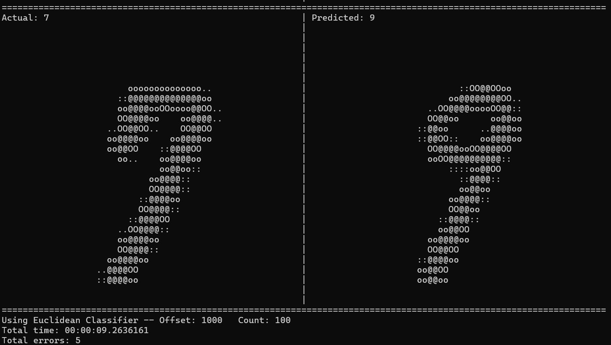
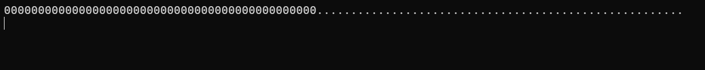
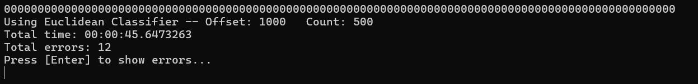
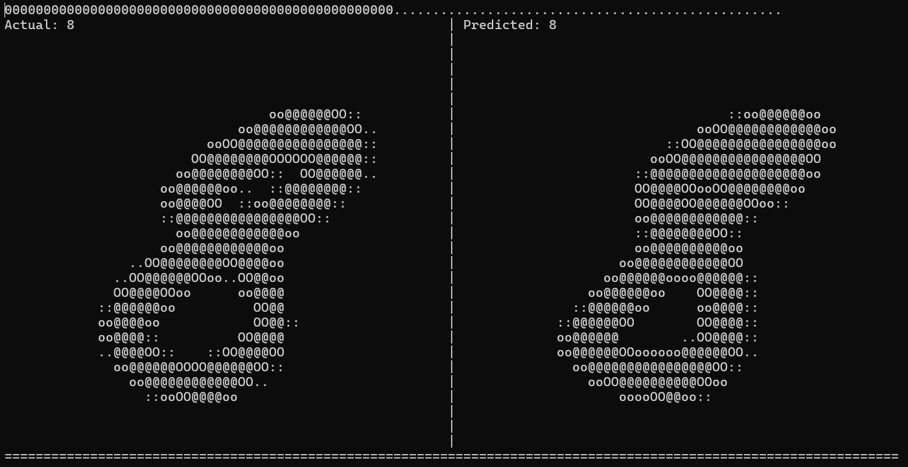

# Lab 03 - Adding Progress Reporting to an Application

## Objectives

This lab uses a machine-learning application that recognizes hand-written digits (0 through 9). The current application shows the number of digits processed and outputs the number that were recognized incorrectly. The process takes several seconds to several minutes to complete (depending on the number of items processed). The objective of this lab is to use progress reporting to add a progress bar as well as a visualizer to show the last item processed.  

*Note: The algorthms used here are very naive (i.e. not very complex). They use a "closest match" methodology. It is error prone; however, it still achieves 93%-96% accuracy.*  

## Application Overview

The "Starter" folder contains the code files for this lab. 

>Both .NET 8 and .NET 9 versions of this code are available. If you are using .NET 8, be aware that instructions that reference "dotnet9" or "net9.0" need to be changed to "dotnet8" and "net8.0", respectively.

**Visual Studio 2022:** Open the "DigitDisplay.sln" solution.  
**Visual Studio Code:** Open the "Starter" folder in VS Code.  

This is a console application that recognizes hand-written digits from image data. There are 2 basic algorithms that vary in correctness and speed. 

The "digit-console" project the console application that runs the recognizer and displays errors in a pseudo-graphical format.

The "recognizer" project the algorithms and the ability to load the raw data from the file system.

**Visual Studio 2022:**  
Build the application (by using F6 or "Build Solution" from the Build menu). Because there is a pseudo-graphical element, I recommend that you run the application directly from a command line (more information below).

**Visual Studio Code:**  
Build the application. One way to do this is from the command line.

* Open a command prompt (PowerShell, Terminal, or cmd.exe) and navigate to the project folder: *[working_directory]\Lab03\dotnet9\Starter\\*

* Build the application using "dotnet build".

```
PS C:..\Lab03\dotnet9\Starter> dotnet build
```

### Running the Application

* Open a command prompt (PowerShell, Terminal, or cmd.exe) and navigate to the output folder for the digit-console application.

>In Windows, and easy way to do this is to open the File Explorer, and navigate to the folder that you want, and then right-click and empty location and choose "Open PowerShell" or "Open Terminal" (if you have Windows Terminal installed).

Sample path for the output folder: ```C:\AsyncWorkshop\Labs\Lab03\dotnet9\Starter\digit-console\bin\Debug\net9.0\```

*Note: be sure to use the appropriate path for the version of .NET you use.*

```
PS C:\AsyncWorkshop\Labs\Lab03\dotnet9\Starter\digit-console\bin\Debug\net9.0>
```

* From the output folder, type ".\digit-console.exe" to run the application. (Most terminal applications have tab completion, so you can type the first few characters and press "Tab" multiple times until you find the correct one.)

```
PS [omitted-path]\bin\Debug\net9.0> .\digit-console.exe
```

* The following will show while the application is running (the slashes "spin" while running):

```
Data Load Complete...
  \  \  \ 
```

* After about 10 seconds, you will get the following output:

```
Data Load Complete...
Using Euclidean Classifier -- Offset: 1000   Count: 100
Total time: 00:00:09.2636161
Total errors: 5
Press [Enter] to show errors...
```

"Count" shows the number of records processed. In this example, 100 records were processed, with 5 incorrect digits recognized.  

* Press [Enter] to show the errors. This shows a pseudo-graphical comparison between the input digit and the closest match.  



> If the output does not look right in your console, you can use Ctrl- to make the font smaller until things line up (Ctrl+ will make the font bigger).

On the left, this sample shows the input value (which is a "7"). On the left is the closest match that the algorithm found ("9"). The algorithms used in this application are very naive. It is pretty impressive that they get 95% accuracy here.

* You can use command-line parameters to change the input values. For example, the following will process 500 records (by changing the "Count" input).  

```
> .\digit-console.exe -c 500
```

You can use this to test the progress bar with various values once you have that in place.

## Lab Goals

There are 2 goals for this lab:  

* Add a progress bar that shows how much is completed vs. how much is left to process.  
* Use additional progress information to show each record immediately after it is processed (similar to the error output).  

The project already includes code to show a progress bar and to output the display "images".

## Current Classes

### digit-console/DigitRecognizer.cs:
```csharp
public static class DigitRecognizer
{
    public static async Task Run(Classifier classifier,
        DigitImage[] validation, List<Prediction> errorLog)
    {
        int totalRecords = validation.Count();
        for (int i = 0; i < totalRecords; i++)
        {
            var imageData = validation[i];
            var result = await classifier.Predict(new(imageData.Value, imageData.Image));

            if (result.Actual.Value != result.Predicted.Value)
            {
                errorLog.Add(result);
            }
        }
    }
}
```

The ```Run``` method has 3 parameters.  
* ```classifier``` is the algorithm (we will use the same algorithm throughout this lab).  
* ```validation``` is the incoming data, i.e., the items we want to recognize.
* ```errorLog``` is a collection to hold the errors.  
* The ```Prediction``` type of the error log has data for both the incoming data and the "closest match" that was found.  

This method loops through the incoming data and runs the classifier ```Predict``` method. This is the calculation-intensive process.

```csharp
var result = await classifier.Predict(new(imageData.Value, imageData.Image));
```

The second part of the loop compares the actual and predicted values. If they do not match, the record is added to the error log.

*Note: This uses a ```for``` loop which has an index of the current record. This will be helpful in calculating the percentage complete for the progress bar.

### digit-console/Program.cs:  

```csharp
public class Program
{
    ...
    static async Task Main(string[] args)
    {
        ...
        // Run the classifier against the data
        Spinner.StartSpinner();
        await DigitRecognizer.Run(classifier, validation, errors);
        Spinner.StopSpinner();
        ...
    }
}
```

The ```DigitRecognizer.Run()``` method (from above) is called in the ```Main``` method. This code snippet starts the spinner animation, waits for the Run method to complete, and stops the spinner animation.  

The other steps in the ```Main``` method involve getting command-line parameters, loading the data file, initializing values, starting/stopping the timer, and output of the summary and errors.  

## Hints

### Progress Bar

**Program**  
In Program.cs:  

* Create a progress object that can be used to get an integer value back from the digit recognizer.  
* Use the ```PrintProgressBar``` method in the Program class to display the progress.

```csharp
public static void PrintProgressBar(int currentCount, int totalRecords)
```

* There is a ```count``` variable in the Program class that can be used for the ```totalRecords``` parameter.  

**Digit Recognizer**  
In DigitRecogizer.cs:  

* Add a progress parameter to the method.  
* Inside the loop, report back the index of the current record.  

### Show Current Record  

**Program**  
In Program.cs:  

* Create a progress object with a custom object that contains the current item (```int```) and the prediction information (```Prediction```).  
* Use the ```PrintProgressBar``` method in the Program class to display the progress.
* Use the ```DisplayImages``` method to show the current prediction.  

```csharp
public static void DisplayImages(Prediction prediction, bool scroll)
```
* Set the ```scroll``` parameter to false. This will overwrite the display with the current value (rather than scrolling the console).  

**Digit Recognizer**  
In DigitRecogizer.cs:  

* Update the progress parameter to the custom type.  
* Inside the loop, report back the current item index and the prediction.  

If you want more assistance, step-by-step instructions are included below. Otherwise, if you'd like to challenge yourself, **STOP READING NOW**


## Progress Bar: Step-By-Step

1. Open the "digit-console/DigitRecognizer.cs" file.

2. Create a copy of the existing ```Run``` method and add a new ```IProgress<int>``` parameter.  

Here are the 2 methods (with the method bodies hidden):  
```csharp
public static async Task Run(Classifier classifier,
    DigitImage[] validation, List<Prediction> errorLog) { ... }

public static async Task Run(Classifier classifier,
    DigitImage[] validation, List<Prediction> errorLog,
    IProgress<int>? progress) { ... }
```

> Another option is to create an optional parameter on the current method. I prefer to have separate overloads.

3. Update the original "Run" method to call the newly created one. This will elimate duplicated code.  

```csharp
public static Task Run(Classifier classifier,
    DigitImage[] validation, List<Prediction> errorLog)
{
    return Run(classifier, validation, errorLog, null);
}
```

4. Use ```progress.Report``` to report the number of the current item. Since the ```for``` loop is zero-based, add one to the value before reporting it.  

```csharp
public static async Task Run(Classifier classifier,
    DigitImage[] validation, List<Prediction> errorLog,
    IProgress<int>? progress)
{
    int totalRecords = validation.Count();
    for (int i = 0; i < totalRecords; i++)
    {
        var imageData = validation[i];
        var result = await classifier.Predict(new(imageData.Value, imageData.Image));

        progress?.Report(i + 1);

        if (result.Actual.Value != result.Predicted.Value)
        {
            errorLog.Add(result);
        }
    }
}
```

5. Open the "digit-console/Program.cs" file.  

6. Disable the spinner animation by commenting out or removing the code:  

```csharp 
// Run the classifier against the data
//Spinner.StartSpinner();
await DigitRecognizer.Run(classifier, validation, errors);
//Spinner.StopSpinner();
```

7. Create a new ```IProgress<int>``` variable and instantiate a ```Progress<int>``` object.

```csharp
// Run the classifier against the data
IProgress<int> progress = new Progress<int>();

await DigitRecognizer.Run(classifier, validation, errors);
```

8. In the progress object constructor, add a delegate to call the ```PrintProgressBar``` method.  

```csharp
// Run the classifier against the data
IProgress<int> progress = new Progress<int>(
    current => PrintProgressBar(current, count));

await DigitRecognizer.Run(classifier, validation, errors);
```

The delegate parameter ```current``` represents the current index reported by the ```Run``` method. The ```count``` value is a class-level value that has the number of records to process.

9. Add the progress parameter to the ```Run``` method call.  

```csharp
await DigitRecognizer.Run(classifier, validation, errors, progress);
```

10. Build the application.

11. Run the application from the command line.

You should now see an animated progress bar at the top of the screen.  



When complete, the progress bar should be full:  

  

12. Try different "count" values from the command line to see the progress bar move at different speeds.  

```
> .\digit-console.exe -c 10
```
```
> .\digit-console.exe -c 500
```

Now we have a working progress bar. Next, let's add images showing the last item processed.


## Show Current Record: Step-By-Step

1. Open the "digit-console/DigitRecognizer.cs" file.  

2. Above the ```DigitRecognizer``` class definition, add a new type to hold the custom progress reporting object called "RecognizerProgress". This has both a ```Prediction``` property and an ```int``` property.  

```csharp
namespace digit_console;

public record RecognizerProgress(int currentCount, Prediction prediction) { }

public static class DigitRecognizer
{...}
```

>Note: I use a ```record``` type here. Other options would be a custom ```class``` with these properties or a tuple that contains the 2 values.  

3. Update the ```Run``` method to use ```IProgress<RecognizerProgress>``` instead of ```IProgress<int>```.  

```csharp
public static async Task Run(Classifier classifier,
    DigitImage[] validation, List<Prediction> errorLog,
    IProgress<RecognizerProgress>? progress)
    {...}
```        

4. Update the ```Report``` method call with the new parameter.  

```csharp
progress?.Report(new RecognizerProgress(i + 1, result));
```

This can alternately be shorted by using target-typed new.  

```csharp
progress?.Report(new(i + 1, result));
```

In this code the ```RecognizerProgress``` type of the new is figured out by the compiler. Use the syntax that is most readable / understandable to you.

5. Open the "digit-console/Program.cs" file.  

6. Update the ```progress``` variable to ```IProgress<RecognizerProgress>```.  

```csharp
// Run the classifier against the data
IProgress<RecognizerProgress> progress = 
    new Progress<RecognizerProgress>(
    current => 
        PrintProgressBar(current.currentCount, count));
```

Note that in addition to changing the generic types, you also need to update the ```current``` parameter to ```current.currentCount```.  

7. If you build and run the application at this point, you will see the same functionality we had before.  

Now, we can add the additional progress display.  

8. Add braces to the body of the progress reporting delegate so that we can add more code to the delegate.  

```csharp
IProgress<RecognizerProgress> progress = 
    new Progress<RecognizerProgress>(
    current => 
    {
        PrintProgressBar(current.currentCount, count);
    });
```

*Note: You will also need to add a semi-colon after the ```PrintProgressBar``` line.*  

9. Add a call to "DisplayImages" with the prediction from the progress object and "false" as the scroll parameter.  

```csharp
// Run the classifier against the data
IProgress<RecognizerProgress> progress = 
    new Progress<RecognizerProgress>(
    current => 
    {
        PrintProgressBar(current.currentCount, count);
        DisplayImages(current.prediction, false);
    });
```

10. Build and run the application. You should now see the current item "images" flashing by. (They go pretty quickly).  

Here is a sample:  



This shows a correct identification with the item on the left and the closest match on the right.  

Note that the progress bar is still working at the top of the screen.  

## Conclusion

In this lab, we have seen how to add simple progress reporting (a number that is used for a progress bar) as well as more complex reporting to show the current item.  

***
*Lab 03 - Adding Progress Reporting to an Application*
***
